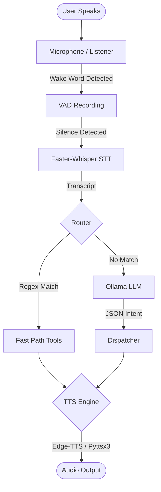
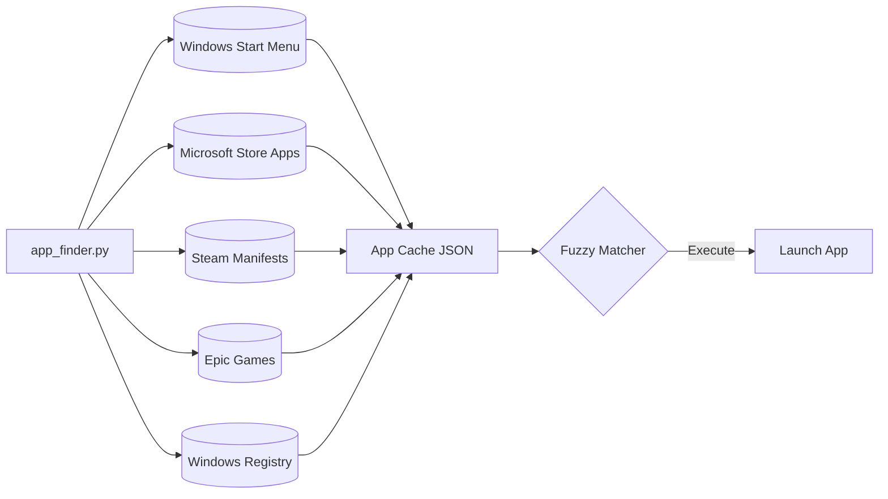
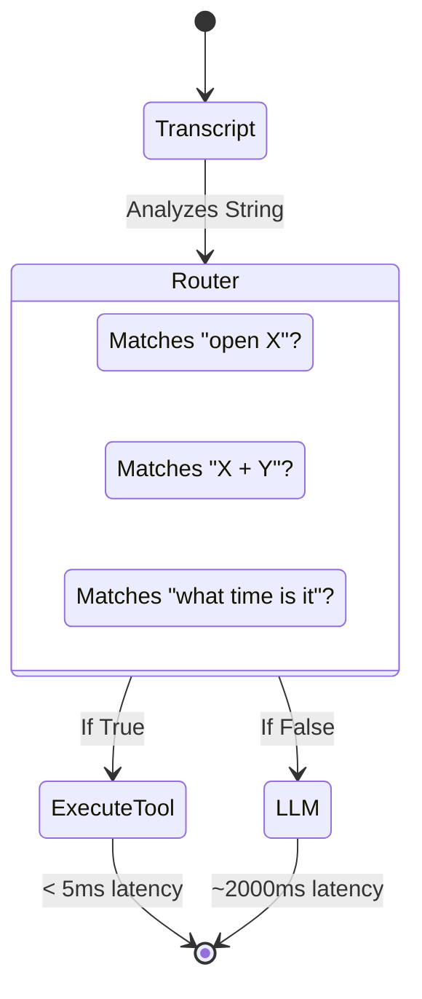

<div align="center">

# 🤖 Clovis

**Your Personal AI Desktop Assistant**

[](https://www.python.org/downloads/)
[](https://ollama.com/)
[](https://github.com/SYSTRAN/faster-whisper)
[](https://github.com/Textualize/rich)

Clovis is an entirely local, voice-activated AI assistant built for Windows. 
Powered by **Ollama** and **Faster-Whisper**, it understands natural language to control your PC, launch apps, manage files, and automate tasks — completely offline.

</div>

---

## 📑 Table of Contents
- [Features](#-features)
- [System Architecture](#-system-architecture)
- [Installation Guide](#-installation-guide)
- [Usage & Commands](#-usage--commands)
- [Project Structure](#-project-structure)
- [Configuration](#-configuration)
- [Troubleshooting](#-troubleshooting)

---

## ✨ Features

Clovis is designed to replace basic voice assistants by integrating directly with your local operating system and LLM infrastructure.

| Category | Capabilities |
| :--- | :--- |
| **🗣️ Voice Engine** | Real-time wake-word detection, robust VAD (Voice Activity Detection), and offline Whisper STT. |
| **🖥️ App Launcher** | Zero-configuration app discovery. Scans Windows Start Menu, Microsoft Store apps, Epic Games, Steam libraries, and the Windows Registry. |
| **⚡ Fast Path Routing** | Sub-10ms response times for common tasks via regex interception, bypassing the LLM entirely. |
| **🧠 Local LLM** | Complex, ambiguous requests fall back to a local `qwen2.5:3b-instruct` model (or any Ollama model of your choice). |
| **📁 OS Integration** | Take screenshots, control system volume, lock the screen, and perform deep file system operations. |
| **🌐 Web & Tools** | Open URLs, perform web searches, send WhatsApp messages, and compose Gmail drafts. |
| **🎨 Premium UI** | Features a `rich`-powered terminal interface with live listening indicators, dynamic status panels, and styled LLM responses. |

---

## 🏗️ System Architecture

Clovis uses a sophisticated pipeline to ensure latency is kept to an absolute minimum.

### High-Level Execution Flow



### The App Discovery Engine

The Smart App Launcher dynamically indexes your machine on startup to ensure it can launch anything you ask it to, without hardcoded lists.



### The Fast Path Routing System

To prevent the LLM from bottlenecking simple requests, the `router.py` intercepts specific patterns instantly.



---

## 🚀 Installation Guide

Clovis requires a Windows environment with Python and Ollama installed.

### Prerequisites

1. **Windows 10 or 11**
2. **Python 3.10+**: Download from [python.org](https://www.python.org/downloads/). 
   > [!IMPORTANT]  
   > When installing Python, ensure you check the box that says **"Add Python to PATH"** at the bottom of the installer.
3. **Ollama**: Download from [ollama.com](https://ollama.com). Install it and ensure it is running in your system tray.

### Method 1: Automatic Setup (Recommended)

1. Double-click the `install.bat` file in the project folder.
2. The script will automatically:
   - Create a Python virtual environment (`.venv`)
   - Install all required libraries
   - Pull the `qwen2.5:3b-instruct` model via Ollama.

### Method 2: Manual Setup

If you prefer to set up the environment manually, execute these commands in your PowerShell terminal:

```powershell
# 1. Create and activate a virtual environment
python -m venv .venv
.\.venv\Scripts\activate

# 2. Install dependencies
pip install -r requirements.txt

# 3. Pull the Ollama LLM model
ollama pull qwen2.5:3b-instruct
```

> [!NOTE]  
> On your very first run, the system will automatically download the `faster-whisper` base model (approx. 70MB). 

---

## 🎮 Usage & Commands

### Booting the Assistant
Use the provided batch scripts for quick access:
- **`start_clovis.bat`**: Launches Voice Mode. The assistant idles in the background until it hears "Clovis".
- **`start_text.bat`**: Launches Text Mode. Ideal for quiet environments.

Alternatively, run the interactive menu from the terminal:
```powershell
.\.venv\Scripts\activate
python main.py
```

### Supported Commands

Clovis supports highly flexible natural language. Try combining commands or asking ambiguous questions.

**System & App Control:**
- *"Open WhatsApp"*
- *"Launch Visual Studio Code"*
- *"Take a screenshot"*
- *"Lock my PC"*
- *"Turn the volume down by 20 percent"*

**File Management:**
- *"Create a folder called 'Q3 Reports' on my desktop"*
- *"List all files in my downloads folder"*
- *"Delete the file named temp.txt"*

**Utilities & Web:**
- *"What is 45 times 12?"*
- *"Search YouTube for Python tutorials"*
- *"Download https://example.com/file.zip"*
- *"Draft a new email"*

---

## 📂 Project Structure

```text
voice-agent/
├── main.py          # Central execution loop and UI menu
├── router.py        # Fast-path regex interceptor
├── brain.py         # LLM API wrapper and JSON parser
├── dispatcher.py    # Maps LLM JSON intents to Python functions
├── listener.py      # VAD, Microphone logic, and Whisper STT
├── tts.py           # Speech synthesis (edge-tts / pyttsx3)
├── ui.py            # Rich terminal UI components (banners, loaders)
├── config.py        # Global settings
├── prompts/
│   └── system_prompt.txt # Master prompt instructing the LLM
└── tools/
    ├── app_finder.py   # Advanced multi-source app discovery
    ├── file_ops.py     # File system manipulations
    ├── system_ops.py   # Screenshots, volume, locking
    ├── browser.py      # Web navigation
    └── downloader.py   # File downloading logic
```

---

## ⚙️ Configuration

Tweak how Clovis behaves by editing `config.py`:

```python
WAKE_WORD          = "clovis"               # The trigger phrase
OLLAMA_MODEL       = "qwen2.5:3b-instruct"  # The LLM model to query
WHISPER_MODEL_SIZE = "base"                 # STT accuracy ('tiny', 'base', 'small')
```

### Changing the Voice
Open `tts.py` to change the default Microsoft Edge Neural voice. 
- Female (Default): `en-IN-NeerjaNeural`
- Male: `en-IN-PrabhatNeural`

### Environment Variables
- **Username Override**: Clovis reads `%USERNAME%`. To override this natively, set `$env:CLOVIS_USER = "YourName"`.
- **System Paths**: Clovis actively queries the Windows Registry to find your Desktop, Downloads, and Documents folders, meaning it supports custom mapped network drives and OneDrive seamlessly.

---

## 🛠️ Troubleshooting

Run the diagnostic script at any time to verify your system integrity:
```powershell
python setup_check.py
```

| Symptom | Diagnosis / Resolution |
| :--- | :--- |
| **Command fails with "Python not found"** | Python isn't in your PATH. Reinstall Python and check the "Add to PATH" box. |
| **"Could not connect to Ollama"** | Ensure the Ollama app is running in your Windows System Tray. |
| **Microphone is ignored** | Check Windows Privacy settings to ensure "Allow apps to access your microphone" is enabled. |
| **No audio output (TTS fails)** | `edge-tts` requires an active internet connection. If offline, it falls back to `pyttsx3`. Ensure your speakers are unmuted. |
| **ModuleNotFoundError: No module named 'rich'** | You forgot to install the dependencies. Run `pip install -r requirements.txt`. |

<div align="center">
<i>Built with ❤️ for a privacy-first, fully-local AI future.</i>
</div>
