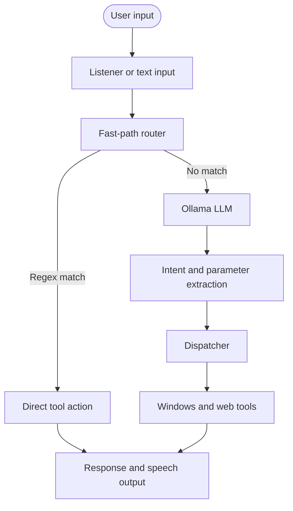

<div align="center">

# Clovis

**Your Personal AI Desktop Assistant**

[](https://www.python.org/downloads/)
[](https://ollama.com/)
[](https://github.com/SYSTRAN/faster-whisper)
[](https://github.com/Textualize/rich)

Clovis is a Windows desktop assistant that combines local speech recognition, a local Ollama model, fast command routing, and direct Windows integrations.

</div>

---

## Table of Contents

- [Features](#features)
- [System Architecture](#system-architecture)
- [Installation Guide](#installation-guide)
- [Usage & Commands](#usage--commands)
- [Project Structure](#project-structure)
- [Development & Testing](#development--testing)
- [Configuration](#configuration)
- [Troubleshooting](#troubleshooting)

---

## Features

| Category | Capabilities |
| :--- | :--- |
| **Voice engine** | Wake-word listening, voice activity detection, and offline Faster-Whisper speech-to-text. |
| **App launcher** | Discovers Windows Start Menu, Microsoft Store, Steam, Epic Games, and registry applications without a hardcoded app list. |
| **Fast command routing** | Handles common time, date, math, app-launch, volume, screenshot, lock, greeting, and farewell commands without calling the LLM. |
| **Local LLM** | Sends ambiguous or complex requests to Ollama. The default model is `qwen2.5:3b-instruct`, but another installed Ollama model can be configured. |
| **Windows integration** | Launches applications, controls volume, locks the workstation, takes screenshots, and performs file and folder operations. |
| **Web and messaging tools** | Opens web pages, searches the web, opens Gmail compose windows, and sends WhatsApp messages through the desktop app or web fallback. |
| **Reminders** | Creates, lists, cancels, and snoozes reminders using Windows Task Scheduler and local notifications. |
| **Terminal UI** | Uses Rich for status panels, listening indicators, thinking feedback, and formatted responses. |

Core routing, Ollama inference, app discovery, and Windows tool execution run locally. Edge-TTS and web-based features require internet access; `pyttsx3` is available as an offline speech fallback.

---

## System Architecture



### App discovery

The app finder builds an index from Windows Start Menu entries, Microsoft Store apps, Steam manifests, Epic Games manifests, and the Windows Registry. The index is cached in `app_cache.json` and refreshed when it becomes stale.

### Fast-path routing

`router.py` intercepts common commands before the LLM is invoked. This keeps frequent actions responsive and allows the assistant to continue working when Ollama is unavailable.

### Speech and response pipeline

Voice mode uses Faster-Whisper for transcription. Responses are rendered in the terminal and sent to Edge-TTS when available, with `pyttsx3` used as a fallback.

---

## Installation Guide

Clovis requires Windows 10 or 11, Python 3.10 or newer, and Ollama for LLM-backed requests.

### Prerequisites

1. Install Python 3.10 or newer from [python.org](https://www.python.org/downloads/).
2. During installation, enable **Add Python to PATH**.
3. Install Ollama from [ollama.com](https://ollama.com) and make sure it is running.
4. Allow microphone access for terminal applications in Windows privacy settings if you plan to use voice mode.

### Automatic setup

From the `voice-agent` directory, double-click `install.bat` or run:

```powershell
.\install.bat
```

The installer:

- Creates `.venv`
- Installs `requirements.txt`
- Pulls `qwen2.5:3b-instruct` when Ollama is available

To make the launcher available from any terminal, run:

```powershell
.\add_to_path.bat
```

Open a new terminal and run `clovis`, or double-click `clovis.bat` from the project directory.

### Manual setup

```powershell
python -m venv .venv
.\.venv\Scripts\activate
python -m pip install --upgrade pip
pip install -r requirements.txt
ollama pull qwen2.5:3b-instruct
```

The first voice-mode run downloads the Faster-Whisper `base` model if it is not already cached.

---

## Usage & Commands

### Launch options

- **`clovis.bat`**: Shows a menu for chat, voice, direct-voice, and hybrid modes.
- **`start_clovis.bat`**: Starts voice mode.
- **`start_text.bat`**: Starts text mode without using the microphone.
- **`python main.py`**: Starts the interactive mode menu.
- **`python main.py --text`**: Types commands in the terminal.
- **`python main.py --no-wake-word`**: Listens for voice commands immediately.
- **`python main.py --hybrid`**: Allows typing a command or pressing Enter to speak.

The default wake phrase is `wake up`, as configured in `config.py`.

### Example commands

**System and applications**

- `open WhatsApp`
- `launch Visual Studio Code`
- `take a screenshot`
- `lock my PC`
- `turn the volume down by 20 percent`

**Files**

- `create a folder called Q3 Reports on my desktop`
- `list all files in my downloads folder`
- `delete the file named temp.txt`
- `move notes.txt to documents`

**Utilities and web**

- `what is 45 times 12`
- `what time is it`
- `what date is it`
- `search YouTube for Python tutorials`
- `open Gmail`
- `compose an email to person@example.com`
- `send a WhatsApp message to John saying hello`
- `remind me to drink water in 10 minutes`

Natural-language requests that do not match a fast-path rule are sent to Ollama.

---

## Project Structure

```text
voice-agent/
├── main.py                 # Entry point and run-mode loops
├── router.py               # Fast-path regex routing
├── brain.py                # Ollama client and JSON extraction
├── dispatcher.py           # Intent-to-tool dispatch
├── listener.py             # Microphone, VAD, and Whisper STT
├── tts.py                  # Edge-TTS and pyttsx3 output
├── ui.py                   # Rich terminal interface
├── config.py               # Application settings and Windows paths
├── setup_check.py          # Environment validator
├── reminder_trigger.py     # Scheduled reminder entry point
├── test_extract.py         # JSON extraction tests
├── prompts/
│   └── system_prompt.txt   # LLM intent schema and instructions
├── tools/
│   ├── app_finder.py       # Multi-source application discovery
│   ├── browser.py          # Browser actions
│   ├── downloader.py       # File downloads
│   ├── file_ops.py         # File and folder operations
│   ├── gmail.py            # Gmail browser shortcuts
│   ├── messenger.py        # WhatsApp messaging
│   ├── reminder.py         # Reminder management
│   └── system_ops.py       # Volume, screenshots, and workstation actions
└── *.bat                   # Setup, launcher, and mode scripts
```

Runtime files such as `agent.log`, `app_cache.json`, `reminders.json`, and `clovis.lock` are generated locally and are ignored by Git.

---

## Development & Testing

Run the environment validator:

```powershell
python setup_check.py
```

Run the JSON extraction tests:

```powershell
python test_extract.py
```

Compile-check the Python sources:

```powershell
python -m compileall .
```

Keep temporary scripts and experimental output in a `debug/` or `scratch/` directory. Those directories are ignored by Git.

---

## Configuration

Edit `config.py` to change application behavior:

```python
USERNAME = "Your Name"
WAKE_WORD = "wake up"
OLLAMA_MODEL = "qwen2.5:3b-instruct"
WHISPER_MODEL_SIZE = "base"
```

`config.py` reads the current user's Desktop, Downloads, and Documents locations from the Windows Registry and falls back to the user profile when a registry lookup fails.

### Changing the speech voice

Edit the voice identifiers in `tts.py`:

- Female default: `en-IN-NeerjaNeural`
- Male: `en-IN-PrabhatNeural`

### Runtime data

- `agent.log`: dispatcher and intent logs
- `app_cache.json`: cached application index
- `reminders.json`: locally stored reminders
- `clovis.lock`: process lock used while Clovis is running

These files are specific to the local installation and should not be committed.

---

## Troubleshooting

Run the diagnostic script:

```powershell
python setup_check.py
```

| Symptom | Diagnosis or resolution |
| :--- | :--- |
| Python is not found | Add Python to PATH during installation, then open a new terminal. |
| Ollama cannot be reached | Start Ollama and verify that port `11434` is reachable. |
| The configured model is missing | Run `ollama pull qwen2.5:3b-instruct`. |
| The microphone is ignored | Enable microphone access for terminal applications in Windows privacy settings. |
| No audio is produced | Check the selected output device. Edge-TTS needs internet; `pyttsx3` can run offline. |
| A package is missing | Run `pip install -r requirements.txt` inside `.venv`. |
| App discovery is stale | Delete `app_cache.json`; Clovis rebuilds it on the next launch. |
| Reminders do not fire | Check Windows Task Scheduler permissions and ensure `reminder_trigger.py` remains in the project directory. |

<div align="center">
<i>Built for a privacy-first, locally controlled AI desktop experience.</i>
</div>
